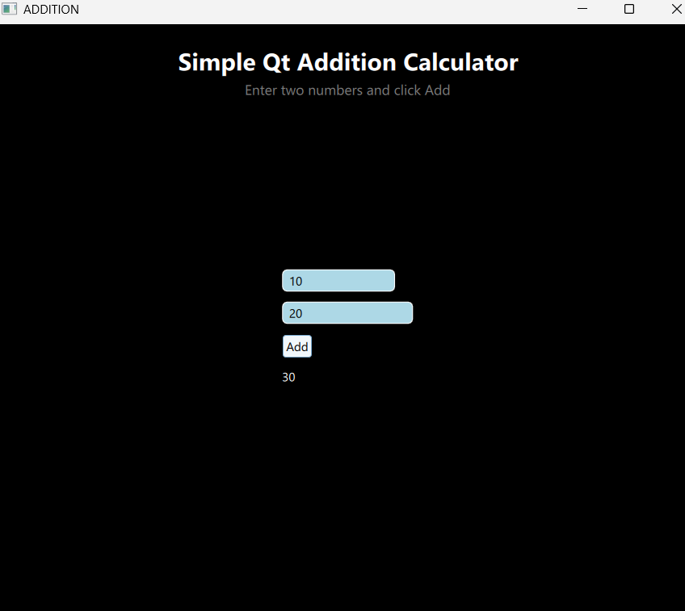

# Qt-Addition-Calculator
Beginner-friendly Qt GUI project demonstrating user input handling, signals and slots, and basic arithmetic operations using C++ and QML.

##  Project Description

This project is a beginner-friendly Qt application that demonstrates the use of:
- Qt Quick UI design (QML)
- User input handling using TextField
- Button click events
- Basic arithmetic operations in C++

The user enters two numbers, clicks the **Add** button, and the result is displayed instantly.

---

## Features

- Simple and clean UI
- Input two numbers
- Instant addition result
- Beginner-friendly Qt Quick layout
- Dark theme interface

---

## Technologies Used

- C++
- Qt Quick (QML)
- Qt Creator IDE

  ---

  ## Screenshot
  

